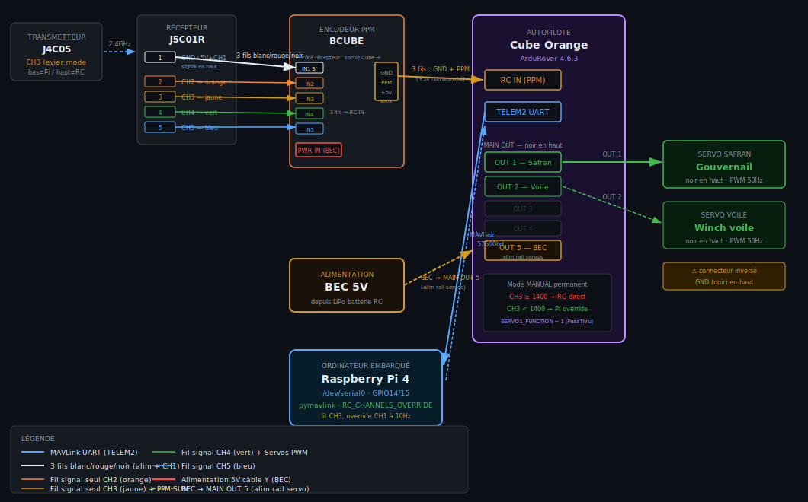

# ⛵ Focus — PoC Bascule RC / Pi via Cube Orange

> **Projet Focus · Voilier autonome**  
> Documentation complète — câblage, configuration Mission Planner, et code Pi


---

## Sommaire

1. [Architecture générale](#1-architecture-générale)
2. [Câblage détaillé](#2-câblage-détaillé)
3. [Configuration Mission Planner](#3-configuration-mission-planner)
4. [Configuration Raspberry Pi](#4-configuration-raspberry-pi)
5. [Script Python (v8 — version validée)](#5-script-python-v8--version-validée)
6. [Procédure de test](#6-procédure-de-test)
7. [Dépannage](#7-dépannage)

---

## 1. Architecture générale

Le **Cube Orange** joue le rôle de multiplexeur : en mode **MANUAL** il passe-through les signaux RC vers les servos. Le **Raspberry Pi** prend le contrôle en envoyant des messages `RC_CHANNELS_OVERRIDE` sur le canal CH1 via MAVLink.

Le **CH3** du levier de la J4C05 est lu en temps réel par le Pi via MAVLink. Quand `CH3 < 1400µs` (levier bas), le Pi active ses overrides. Quand `CH3 ≥ 1400µs` (levier haut), le Pi libère tout et le RC reprend le contrôle physique.



> **Pourquoi rester en MANUAL ?**  
> Le mode GUIDED d'ArduRover est conçu pour la navigation autonome vers des waypoints. Sans target actif, il bascule automatiquement en HOLD après ~1.5s. Le mode MANUAL avec `RC_CHANNELS_OVERRIDE` est plus adapté pour du contrôle direct de servo.

---

## 2. Câblage détaillé

### A — Alimentation (câble Y depuis le BEC)

Un seul BEC 5V avec un câble en Y alimente récepteur et encodeur en parallèle.

| BEC 5V (sortie Y) | Destination | Fils |
|---|---|---|
| Branche 1 | BCUBE — connecteur PWR IN | Rouge + Noir (3 fils) |
| Branche 2 | J5C01R — prise alim dédiée | Rouge + Noir (3 fils) |

Un troisième câble va du BEC vers le **MAIN OUT 5** du Cube Orange pour alimenter le rail des servos.

> ⚠️ **GND commun obligatoire** — BEC, récepteur, encodeur et Cube RC IN doivent partager le même GND.

> ⚠️ **Rail MAIN OUT à alimenter séparément** — Le Cube ne fournit pas de 5V sur ses sorties servo. Brancher un BEC sur MAIN OUT 5 sinon les servos ne reçoivent aucune alimentation.

---

### B — J5C01R → Encodeur BCUBE (signaux)

Le port 1 du récepteur utilise un câble 3 fils (blanc/rouge/noir, **signal en haut**).  
Les ports 2 à 5 utilisent des fils signal seul (1 conducteur chacun), colorés.

| J5C01R port | Couleur fil | BCUBE entrée | Canal | Note |
|---|---|---|---|---|
| 1 | Blanc/Rouge/Noir (3 fils) | IN1 | CH1 | Signal en haut · Safran |
| 2 | 🟠 Orange | IN2 | CH2 | Voile |
| 3 | 🟡 Jaune | IN3 | CH3 | **← levier de mode** |
| 4 | 🟢 Vert | IN4 | CH4 | |
| 5 | 🔵 Bleu | IN5 | CH5 | |

---

### C — Encodeur BCUBE → Cube Orange RC IN

Prise 4 pins isolée du BCUBE (GND · +5V · PPM · MUX). **3 fils** vers le Cube RC IN.

| BCUBE (prise 4 pins) | Cube Orange RC IN | Note |
|---|---|---|
| GND | GND | Noir |
| PPM | Signal | Blanc |
| +5V | +5V | Rouge |
| MUX | **NON connecté** | Non utilisé |

---

### D — Cube Orange TELEM2 → Raspberry Pi UART

Connecteur JST-GH 6 broches. Seulement TX, RX, GND utilisés. Niveaux 3.3V des deux côtés — **pas de level shifter**.

| Cube TELEM2 | Pin | Raspberry Pi | GPIO |
|---|---|---|---|
| 5V | 1 | **NON connecté** | — |
| TX | 2 | RXD pin 10 | GPIO15 |
| RX | 3 | TXD pin 8 | GPIO14 |
| CTS | 4 | **NON connecté** | — |
| RTS | 5 | **NON connecté** | — |
| GND | 6 | GND pin 6 | — |

> ℹ️ **TX↔RX croisés** — TX du Cube vers RX du Pi, et RX du Cube vers TX du Pi. C'est intentionnel.

---

### E — MAIN OUT → Servos

> ⚠️ **Connecteurs MAIN OUT inversés** — GND (noir) en haut sur ce carrier board. Retourner le connecteur servo à 180° avant de brancher.

| MAIN OUT | Servo | SERVO_FUNCTION | Neutre |
|---|---|---|---|
| OUT 1 | Safran (gouvernail) · noir en haut | **1 — RCPassThru** ⚠️ OBLIGATOIRE | ~1500µs |
| OUT 2 | Voile (winch) · noir en haut | 89 — MainSail | ~1500µs |

> 🔴 **SERVO1_FUNCTION doit être 1 (RCPassThru)**  
> Avec GroundSteering (26), ArduPilot recalcule en permanence la valeur et écrase les overrides du Pi après quelques cycles. En RCPassThru, ArduPilot transmet exactement ce qu'il reçoit sur CH1.

---

## 3. Configuration Mission Planner

### Paramètres essentiels (Full Parameter List)

| Paramètre | Valeur | Signification |
|---|---|---|
| `SERIAL2_PROTOCOL` | **2** | MAVLink2 sur TELEM2 |
| `SERIAL2_BAUD` | **57** | 57600 baud |
| `MODE_CH` | **3** | CH3 = canal de sélection de mode |
| `MODE1` | **15** | Guided — levier CH3 fond bas (~900µs) |
| `MODE2` | **15** | Guided |
| `MODE3` | **15** | Guided — levier CH3 mi-bas |
| `MODE4` | **0** | Manual — levier CH3 mi-haut |
| `MODE5` | **0** | Manual |
| `MODE6` | **0** | Manual — levier CH3 fond haut (~2000µs) |
| `SERVO1_FUNCTION` | **1** | RCPassThru — OBLIGATOIRE pour override Pi |
| `SERVO2_FUNCTION` | **89** | MainSail (voile) |
| `SERVO1_MIN` | **1100** | PWM minimum safran |
| `SERVO1_MAX` | **1900** | PWM maximum safran |
| `SERVO1_TRIM` | **1500** | PWM neutre safran |
| `RC_PROTOCOLS` | **1** | PPM uniquement |
| `FS_GCS_ENABLE` | **0** | Désactiver failsafe GCS pour le PoC |

> ✅ **Vérification Radio Calibration**  
> Dans Setup → Mandatory Hardware → Radio Calibration, vérifier que CH3 varie bien de ~900µs (fond bas) à ~2000µs (fond haut). La frontière de bascule est à ~1400µs (mi-course du levier).

---

## 4. Configuration Raspberry Pi

### Étape 1 — Libérer le port série ttyAMA0 du Bluetooth

Ajouter dans `/boot/firmware/config.txt` :

```
dtoverlay=disable-bt
enable_uart=1
```

Désactiver le getty série :

```bash
sudo systemctl disable hciuart
sudo systemctl disable serial-getty@ttyAMA0.service
sudo reboot
```

### Étape 2 — Installer pymavlink

```bash
pip install pymavlink --break-system-packages
```

### Étape 3 — Créer le répertoire de travail

```bash
mkdir -p /home/admin/focus
```

---

## 5. Script Python (v8 — version validée)

Fichier : `/home/admin/focus/test_mavlink_switch_v8.py`

```python
#!/usr/bin/env python3
# -*- coding: utf-8 -*-
"""
Focus PoC - Bascule RC / Pi via Cube Orange
Strategie : MANUAL permanent + RC_CHANNELS_OVERRIDE sur CH1
Le Pi lit CH3 via MAVLink et active/desactive l'override.
SERVO1_FUNCTION doit etre 1 (RCPassThru) dans Mission Planner.
"""

import time
import sys
from pymavlink import mavutil

# ── Configuration ─────────────────────────────────────────────
SERIAL_PORT   = '/dev/serial0'   # port UART Pi
BAUD_RATE     = 57600
SYSID_GCS     = 255
IGNORE        = 65535            # valeur speciale = ne pas overrider ce canal
CH3_THRESHOLD = 1400             # µs : en dessous = Pi, au dessus = RC
TARGET_SYS    = 1
TARGET_COMP   = 1

# ── Connexion ─────────────────────────────────────────────────
master = mavutil.mavlink_connection(SERIAL_PORT, baud=BAUD_RATE, source_system=SYSID_GCS)
print("[FOCUS] Attente heartbeat...")
master.wait_heartbeat()
print(f"[FOCUS] Connecte - sysid={master.target_system}")

# Demander les streams RC et SERVO au Cube
master.mav.request_data_stream_send(
    TARGET_SYS, TARGET_COMP,
    mavutil.mavlink.MAV_DATA_STREAM_RC_CHANNELS, 10, 1
)
master.mav.request_data_stream_send(
    TARGET_SYS, TARGET_COMP,
    mavutil.mavlink.MAV_DATA_STREAM_RAW_CONTROLLER, 10, 1
)
time.sleep(0.5)

# ── Helpers ───────────────────────────────────────────────────
def send_override_ch1(pwm):
    """Override CH1 (safran), tous les autres canaux ignores."""
    master.mav.rc_channels_override_send(
        TARGET_SYS, TARGET_COMP,
        pwm, IGNORE, IGNORE, IGNORE, IGNORE, IGNORE, IGNORE, IGNORE
    )

def clear_override():
    """Relache tous les overrides - RC reprend la main."""
    master.mav.rc_channels_override_send(
        TARGET_SYS, TARGET_COMP,
        IGNORE, IGNORE, IGNORE, IGNORE, IGNORE, IGNORE, IGNORE, IGNORE
    )

def send_heartbeat():
    master.mav.heartbeat_send(
        mavutil.mavlink.MAV_TYPE_GCS,
        mavutil.mavlink.MAV_AUTOPILOT_INVALID,
        0, 0, 0
    )

# Sweep de test : gauche / centre / droite / centre
SWEEP = [
    (1200, "GAUCHE"),
    (1500, "CENTRE"),
    (1800, "DROITE"),
    (1500, "CENTRE"),
]

# ── Boucle principale ─────────────────────────────────────────
pi_in_control  = False
current_pwm    = 1500
sweep_step     = 0
last_sweep     = 0
last_override  = 0        # envoi continu a 10Hz pour eviter timeout
last_heartbeat = 0
last_ch3       = None

print("[FOCUS] Pret - CH3 bas=Pi, CH3 haut=RC\n")

try:
    while True:
        now = time.monotonic()

        # Heartbeat 1Hz (evite le failsafe GCS)
        if now - last_heartbeat >= 1.0:
            send_heartbeat()
            last_heartbeat = now

        # Lire messages MAVLink
        msg = master.recv_match(blocking=False)
        if msg:
            mtype = msg.get_type()

            # Detecter position CH3 → bascule Pi/RC
            if mtype == 'RC_CHANNELS':
                ch3 = msg.chan3_raw
                if last_ch3 is None or abs(ch3 - last_ch3) > 50:
                    last_ch3 = ch3
                    if ch3 < CH3_THRESHOLD and not pi_in_control:
                        pi_in_control = True
                        sweep_step    = 0
                        last_sweep    = 0
                        current_pwm   = 1500
                        print(f"\n[FOCUS] CH3={ch3}us -> PI EN CONTROLE")
                    elif ch3 >= CH3_THRESHOLD and pi_in_control:
                        pi_in_control = False
                        current_pwm   = 1500
                        clear_override()
                        print(f"\n[FOCUS] CH3={ch3}us -> RC en controle")

            # Diagnostic sorties servo en temps reel
            elif mtype == 'SERVO_OUTPUT_RAW' and pi_in_control:
                print(f"  [DIAG] OUT1={msg.servo1_raw} OUT2={msg.servo2_raw}", end='\r')

        # Mode Pi actif
        if pi_in_control:
            # Changer valeur toutes les 1.5s
            if now - last_sweep >= 1.5:
                last_sweep = now
                current_pwm, label = SWEEP[sweep_step % len(SWEEP)]
                print(f"\n[PI->SERVO] Safran {label} -> {current_pwm}us")
                sweep_step += 1

            # Envoyer l'override EN CONTINU a 10Hz (timeout ArduPilot ~0.5s)
            if now - last_override >= 0.1:
                last_override = now
                send_override_ch1(current_pwm)

        time.sleep(0.02)  # boucle 50Hz

except KeyboardInterrupt:
    print("\n[FOCUS] Arret")
    clear_override()
    master.close()
    print("[FOCUS] Connexion fermee.")
    sys.exit(0)
```

---

## 6. Procédure de test

**1. Vérifications avant mise sous tension**

- Connecteurs MAIN OUT retournés à 180° (GND en haut)
- TX↔RX croisés sur le câble TELEM2↔Pi
- BEC branché sur MAIN OUT 5 (rail servo)
- +5V de la prise 4 pins BCUBE non connecté côté Cube

**2. Vérification Radio Calibration (Mission Planner)**

Setup → Mandatory Hardware → Radio Calibration → vérifier CH3 entre ~900µs et ~2000µs. Mettre `SERVO1_FUNCTION=1`, écrire les paramètres.

**3. Test manuel avant de brancher le Pi**

CH3 haut (Manual) → bouger le joystick CH1 → le safran doit répondre. Valide que le câblage servo est correct.

**4. Lancer le script Pi (CH3 haut = RC control)**

```bash
python3 /home/admin/focus/test_mavlink_switch_v8.py
```

Attendre l'affichage `[FOCUS] Pret`.

**5. Bascule CH3 bas → Pi en contrôle**

Le safran doit faire des allers-retours automatiques GAUCHE/CENTRE/DROITE toutes les 1.5s. Le terminal affiche les valeurs OUT1 en temps réel.

**6. Bascule CH3 haut → RC reprend le contrôle**

Le servo cesse de bouger automatiquement. La télécommande reprend le contrôle immédiatement.

---

## 7. Dépannage

| Symptôme | Cause probable | Solution |
|---|---|---|
| Servo ne bouge jamais | Rail MAIN OUT non alimenté | Brancher BEC sur MAIN OUT 5 |
| Servo bouge 1 fois puis bloque | `SERVO1_FUNCTION` ≠ 1 | Mettre `SERVO1_FUNCTION=1` (RCPassThru) |
| CH3 non détecté | Stream RC non reçu | `request_data_stream_send` déjà dans le script |
| Cycling MANUAL/HOLD en boucle | `FS_GCS_ENABLE=1` | Mettre `FS_GCS_ENABLE=0` |
| OUT1/OUT2 absents de Servo/Relay | Normal avec FUNCTION=1 | Vérifier `SERVO_OUTPUT_RAW` via le script |
| `sysid=0 compid=0` à la connexion | Heartbeat reçu avant config | Sans impact, `TARGET_SYS=1` forcé dans le script |
| Servo voile ne répond pas au RC | `SERVO2_FUNCTION=89` = mode sailboat | Mettre `SERVO2_FUNCTION=1` pour test direct |

---

*Focus PoC — Documentation V2 · 25/04/2026 · ArduRover 4.6.3 · pymavlink · RC_CHANNELS_OVERRIDE*
